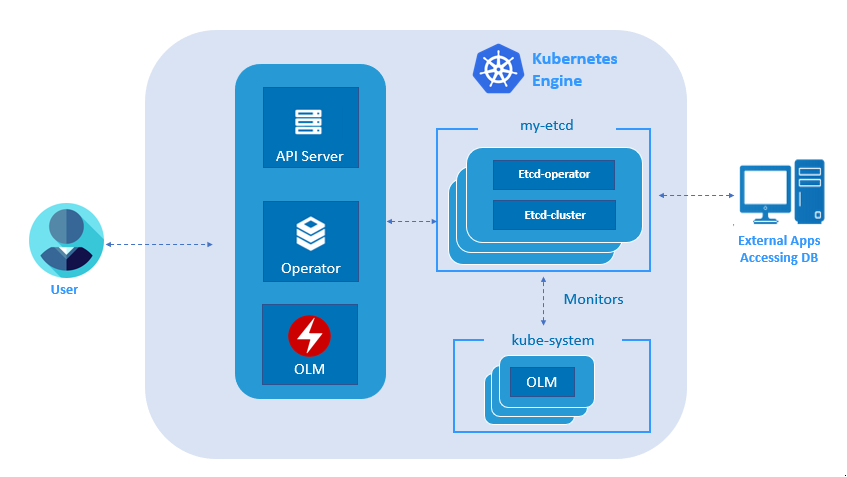

# etcd operator
### Overview
The etcd Operater creates and maintains highly-available etcd clusters on Kubernetes, allowing engineers to easily deploy and manage etcd clusters for their applications.

**etcd-Cluster:**

etcd is a distributed key value store that provides a reliable way to store data across a cluster of machines. It is a open-source and available on GitHub. etcd gracefully handles leader elections during network partitions and will tolerate machine failure, including the leader.

**etcd-Operator:**

The etcd Operator creates and maintains highly-available etcd clusters on Kubernetes, allowing engineers to easily deploy and manage etcd clusters for their applications.

- Create and Destroy
- Resize
- Failover
- Rolling Upgrade
- Backup and Recovery

**etcd Architectural Flow**

To create etcd-cluster instance user need to install olm and deploy etcd operator on kubernetes. etcd-cluster gets created when we apply custom resource definition on operator. User can now create users for etcd-cluster and external application can access etcd-cluster by providing credentials.

### Supported Features
High availability - Multiple instances of etcd are networked together and secured. Individual failures or networking issues are transparently handled to keep your cluster up and running.

Automated updates - Rolling out a new etcd version works like all Kubernetes rolling updates. Simply declare the desired version, and the etcd service starts a safe rolling update to the new version automatically.

Backups included - Create etcd backups and restore them through the etcd Operator.

### Common Configurations
Configure TLS - Specify static TLS certs as Kubernetes secrets.

Set Node Selector and Affinity - Spread your etcd Pods across Nodes and availability zones.

Set Resource Limits - Set the Kubernetes limit and request values for your etcd Pods.

Customize Storage - Set a custom StorageClass that you would like to use.
